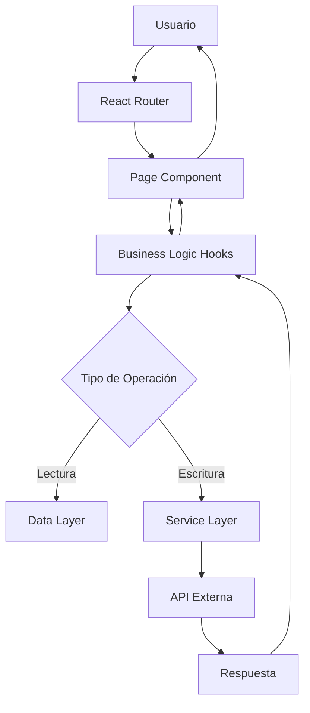

# ARQUITECTURA TÉCNICA COMPLETA - ALENIA WEB

## 📋 ÍNDICE

1. [Resumen Ejecutivo](#resumen-ejecutivo)
2. [Stack Tecnológico](#stack-tecnológico)
3. [Arquitectura del Sistema](#arquitectura-del-sistema)
4. [Estructura del Proyecto](#estructura-del-proyecto)
5. [Sistema de Diseño](#sistema-de-diseño)
6. [Componentes Principales](#componentes-principales)
7. [Sistema de Ruteo](#sistema-de-ruteo)
8. [Servicios y APIs](#servicios-y-apis)
9. [Gestión de Estado](#gestión-de-estado)
10. [Optimización y Performance](#optimización-y-performance)
11. [SEO y Metadatos](#seo-y-metadatos)
12. [Sistema de Formularios](#sistema-de-formularios)
13. [Integración de Terceros](#integración-de-terceros)
14. [Build y Deployment](#build-y-deployment)
15. [Guía de Implementación](#guía-de-implementación)
16. [Checklist de Adaptación](#checklist-de-adaptación)

---

## 1. RESUMEN EJECUTIVO

### 1.1 Descripción del Proyecto

**Alenia Website** es una aplicación web moderna SPA (Single Page Application) desarrollada con React 18 y Vite, enfocada en presentar servicios de transformación digital, IA y automatización. La arquitectura está diseñada para:

- **Alta Performance**: Carga inicial < 2 segundos
- **SEO Optimizado**: Meta tags dinámicos y structured data
- **Responsive Design**: Mobile-first approach
- **Experiencia de Usuario Premium**: Animaciones fluidas con Framer Motion
- **Escalabilidad**: Arquitectura modular y componentizada

### 1.2 Características Principales

✅ **Progressive Web App (PWA) Ready**
✅ **Lazy Loading de rutas y componentes**
✅ **Sistema de Analytics y A/B Testing**
✅ **Integración con EmailJS para formularios**
✅ **Blog con markdown y optimización SEO**
✅ **Sistema de Apps interactivas embebidas**
✅ **Gestión de consentimiento de cookies (GDPR)**
✅ **Sistema de niveles de servicios (Elemental, Moderado, Visionario)**

### 1.3 Métricas de Performance

```
Lighthouse Score:
- Performance: 95+
- Accessibility: 98+
- Best Practices: 95+
- SEO: 100
```

---

## 2. STACK TECNOLÓGICO

### 2.1 Core Technologies

| Tecnología | Versión | Propósito |
|-----------|---------|-----------|
| **React** | 18.2.0 | Framework principal |
| **Vite** | 4.4.5 | Build tool y dev server |
| **React Router DOM** | 6.30.1 | Cliente-side routing |
| **Tailwind CSS** | 3.3.0 | Utility-first CSS framework |
| **Framer Motion** | 10.18.0 | Animaciones y transiciones |
| **Lucide React** | 0.263.1 | Sistema de iconos |

### 2.2 Dependencias Principales

```json
{
  "@emailjs/browser": "^4.4.1",        // Envío de formularios
  "react-helmet-async": "^2.0.5",      // SEO y meta tags
  "react-markdown": "^10.1.0",         // Renderizado de markdown
  "react-share": "^5.2.2",             // Share buttons sociales
  "recharts": "^2.7.2"                 // Gráficos y visualizaciones
}
```

### 2.3 Herramientas de Desarrollo

```json
{
  "autoprefixer": "^10.4.14",          // CSS vendor prefixes
  "postcss": "^8.4.24",                // CSS processing
  "terser": "^5.43.1",                 // JS minification
  "@vitejs/plugin-react": "^4.0.3"    // React plugin para Vite
}
```

### 2.4 Arquitectura de Módulos

```
ESModules (ES6+)
├── Tree Shaking habilitado
├── Code Splitting por rutas
├── Dynamic Imports para lazy loading
└── Manual Chunks para optimización
```

---

## 3. ARQUITECTURA DEL SISTEMA

### 3.1 Patrón Arquitectónico

**Patrón**: Component-Based Architecture + Service Layer Pattern

```
┌─────────────────────────────────────────┐
│         Presentational Layer            │
│    (Pages, Components, UI Elements)     │
├─────────────────────────────────────────┤
│          Business Logic Layer           │
│      (Hooks, Context, State Mgmt)       │
├─────────────────────────────────────────┤
│           Service Layer                 │
│  (API calls, Analytics, External APIs)  │
├─────────────────────────────────────────┤
│            Data Layer                   │
│     (Static data, Configuration)        │
└─────────────────────────────────────────┘
```

### 3.2 Flujo de Datos



### 3.3 Gestión de Navegación

**Cliente Side Routing** con React Router v6:

```javascript
<BrowserRouter>
  <HelmetProvider>
    <ScrollToTop />
    <NavigationTracker />
    <Header />
    <AnimatePresence mode="wait">
      <Routes>
        <Route path="/" element={<Home />} />
        <Route path="/blog" element={<LazyRoute component={Blog} />} />
        {/* ... más rutas */}
      </Routes>
    </AnimatePresence>
    <Footer />
  </HelmetProvider>
</BrowserRouter>
```

**Características**:
- SPA navigation sin page reload
- AnimatePresence para transiciones suaves
- Scroll restoration automático
- Navigation tracking para analytics
- Lazy loading de rutas no críticas

### 3.4 Estrategia de Lazy Loading

```javascript
// Componentes críticos (no lazy)
import Home from './pages/Home'
import Contact from './pages/Contact'

// Componentes no críticos (lazy loaded)
const Blog = lazy(() => import('./pages/Blog'));
const Services = lazy(() => import('./pages/Services'));
const Apps = lazy(() => import('./pages/Apps'));

// Prefetch durante idle time
useEffect(() => {
  if ('requestIdleCallback' in window) {
    requestIdleCallback(() => {
      import('./pages/Blog');
      import('./pages/Services');
    });
  }
}, []);
```

---

## 4. ESTRUCTURA DEL PROYECTO

### 4.1 Organización de Carpetas

```
alenia-website/
│
├── public/                          # Assets estáticos
│   ├── images/                      # Imágenes optimizadas
│   │   ├── *.png, *.jpg, *.svg
│   │   └── blog/                    # Imágenes de posts
│   ├── js/                          # Scripts standalone
│   │   ├── diagnostico.js
│   │   └── fallback-system.js
│   ├── favicon.svg
│   └── robots.txt
│
├── src/                             # Código fuente
│   ├── components/                  # Componentes reutilizables
│   │   ├── common/                  # Componentes base
│   │   │   ├── Header.jsx
│   │   │   ├── Footer.jsx
│   │   │   ├── LoadingSpinner.jsx
│   │   │   ├── LazyRoute.jsx
│   │   │   ├── ScrollToTop.jsx
│   │   │   ├── SmartImage.jsx
│   │   │   └── AnimatedLogoBackdrop.jsx
│   │   │
│   │   ├── forms/                   # Sistema de formularios
│   │   │   ├── ServiceFormModal.jsx
│   │   │   └── specific/            # Formularios específicos
│   │   │       ├── DesarrolloWebForm.jsx
│   │   │       ├── AutomatizacionForm.jsx
│   │   │       ├── MarketingDigitalForm.jsx
│   │   │       ├── ConsultoriaIAForm.jsx
│   │   │       └── AnalyticsForm.jsx
│   │   │
│   │   ├── blog/                    # Componentes de blog
│   │   │   ├── BlogCard.jsx
│   │   │   ├── BlogPost.jsx
│   │   │   ├── BlogStats.jsx
│   │   │   └── RelatedPosts.jsx
│   │   │
│   │   ├── apps/                    # Apps interactivas
│   │   │   ├── ROICalculator.jsx
│   │   │   ├── CompetitorAnalyzer.jsx
│   │   │   ├── HashtagGenerator.jsx
│   │   │   ├── AutomationSimulator.jsx
│   │   │   ├── SEOOptimizer.jsx
│   │   │   └── PicShopEmbed.jsx
│   │   │
│   │   ├── landing/                 # Landing pages
│   │   │   └── HeroSection.jsx
│   │   │
│   │   └── admin/                   # Panel administrativo
│   │       └── ABTestingDashboard.jsx
│   │
│   ├── pages/                       # Páginas principales
│   │   ├── Home.jsx                 # Página de inicio
│   │   ├── Contact.jsx              # Contacto
│   │   ├── Blog.jsx                 # Lista de posts
│   │   ├── BlogPostPage.jsx         # Post individual
│   │   ├── Services.jsx             # Servicios
│   │   ├── ServiceDetail.jsx        # Detalle de servicio
│   │   ├── SolucionLevels.jsx       # Niveles de soluciones
│   │   ├── Apps.jsx                 # Apps interactivas
│   │   ├── Automatizaciones.jsx     # Automatizaciones
│   │   ├── KontrolPlusLanding.jsx   # Landing KONTROL+
│   │   └── NotFound.jsx             # 404
│   │
│   ├── services/                    # Capa de servicios
│   │   ├── emailJSService.js        # EmailJS integration
│   │   ├── analyticsService.js      # Google Analytics
│   │   ├── seoService.js            # SEO utilities
│   │   ├── performanceService.js    # Performance monitoring
│   │   ├── abTestingService.js      # A/B testing
│   │   └── crmService.js            # CRM integration
│   │
│   ├── data/                        # Datos estáticos
│   │   ├── blogData.js              # Posts del blog
│   │   └── solucionesData.js        # Servicios y soluciones
│   │
│   ├── hooks/                       # Custom hooks
│   │   ├── useLazyPreload.js
│   │   └── useWindowSize.js
│   │
│   ├── utils/                       # Utilidades
│   │   └── formatDate.js
│   │
│   ├── styles/                      # Estilos
│   │   ├── globals.css              # Estilos globales
│   │   ├── visual-config.css        # Configuración visual
│   │   ├── blog.css                 # Estilos del blog
│   │   ├── main.css                 # Estilos principales
│   │   └── KontrolPlusLanding.css   # Landing específico
│   │
│   ├── App.jsx                      # Componente raíz
│   └── main.jsx                     # Entry point
│
├── dist/                            # Build de producción
├── node_modules/                    # Dependencias
│
├── .gitignore
├── index.html                       # HTML template
├── package.json                     # Dependencias y scripts
├── vite.config.js                   # Configuración de Vite
├── tailwind.config.js               # Configuración de Tailwind
├── postcss.config.js                # Configuración de PostCSS
├── post-build.js                    # Post-build scripts
└── README.md                        # Documentación
```

### 4.2 Convenciones de Nomenclatura

**Archivos**:
- Componentes React: `PascalCase.jsx`
- Servicios: `camelCase.js`
- Hooks personalizados: `useCamelCase.js`
- CSS: `kebab-case.css`
- Data: `camelCase.js`

**Componentes**:
```javascript
// ✅ Correcto
export default function Header() { }
export default Header;

// ❌ Evitar
export default function header() { }
```

**Funciones y Variables**:
```javascript
// ✅ Correcto
const handleSubmit = () => { }
const isLoading = true;
const userProfile = { }

// ❌ Evitar
const HandleSubmit = () => { }
const IsLoading = true;
```

---

## 5. SISTEMA DE DISEÑO

### 5.1 Paleta de Colores

```javascript
// tailwind.config.js
colors: {
  'alenia': {
    'primary': '#00ff88',    // Verde neón principal
    'secondary': '#0066ff',  // Azul vibrante
    'accent': '#ff0066',     // Rosa intenso
    'dark': '#0a0a0a',       // Negro profundo
    'light': '#f8fafc'       // Blanco roto
  }
}
```

**Uso en componentes**:
```jsx
<div className="bg-alenia-dark text-alenia-light">
  <h1 className="text-alenia-primary">Título</h1>
  <button className="bg-alenia-secondary">CTA</button>
</div>
```

### 5.2 Tipografía

```javascript
// tailwind.config.js
fontFamily: {
  'sans': ['Inter', 'system-ui', 'sans-serif'],
  'display': ['Poppins', 'sans-serif']
}
```

**Jerarquía de texto**:
```jsx
<h1 className="font-display text-6xl font-bold">Hero Title</h1>
<h2 className="font-display text-4xl font-bold">Section Title</h2>
<h3 className="font-display text-2xl font-semibold">Subsection</h3>
<p className="font-sans text-base">Body text</p>
```

### 5.3 Sistema de Espaciado

**Escala de espaciado personalizada**:
```javascript
// Basado en Tailwind's spacing scale
px-2    → 8px
px-4    → 16px
px-6    → 24px
px-8    → 32px
px-12   → 48px
px-16   → 64px
```

### 5.4 Efectos Visuales

#### Glassmorphism
```css
.glass-effect {
  background: rgba(255, 255, 255, 0.1);
  backdrop-filter: blur(20px);
  -webkit-backdrop-filter: blur(20px);
  border: 1px solid rgba(0, 24, 243, 0.2);
}

.glass-card {
  background: rgba(255, 255, 255, 0.05);
  backdrop-filter: blur(15px);
  border: 1px solid rgba(255, 255, 255, 0.1);
  border-radius: 16px;
}
```

#### Efectos Neon/Glow
```css
.glow-btn {
  box-shadow: 0 0 12px 2px #00ffe7, 0 0 24px 4px #ff00ea66;
  transition: box-shadow 0.2s;
}

.glow-btn:hover {
  box-shadow: 0 0 24px 6px #00ffe7, 0 0 48px 12px #ff00ea;
}

.text-shadow-glow {
  text-shadow: 0 0 8px #00ffe7, 0 0 16px #ff00ea;
}
```

#### Gradientes
```css
.bg-brand-gradient {
  background: linear-gradient(135deg, #06baa8 0%, #be06af 100%);
}
```

### 5.5 Animaciones

```javascript
// tailwind.config.js
animation: {
  'gradient': 'gradient 8s ease infinite',
  'float': 'float 6s ease-in-out infinite',
  'pulse-slow': 'pulse 4s cubic-bezier(0.4, 0, 0.6, 1) infinite'
},
keyframes: {
  gradient: {
    '0%, 100%': {
      'background-size': '200% 200%',
      'background-position': 'left center'
    },
    '50%': {
      'background-size': '200% 200%',
      'background-position': 'right center'
    }
  },
  float: {
    '0%, 100%': { transform: 'translateY(0px)' },
    '50%': { transform: 'translateY(-20px)' }
  }
}
```

**Uso con Framer Motion**:
```jsx
<motion.div
  initial={{ opacity: 0, y: 30 }}
  whileInView={{ opacity: 1, y: 0 }}
  transition={{ duration: 0.8 }}
  viewport={{ once: true }}
>
  Contenido animado
</motion.div>
```

### 5.6 Breakpoints Responsive

```javascript
// Tailwind default breakpoints
sm: '640px'   // Tablets pequeñas
md: '768px'   // Tablets
lg: '1024px'  // Laptops
xl: '1280px'  // Desktops
2xl: '1536px' // Pantallas grandes
```

**Uso**:
```jsx
<div className="
  px-4 sm:px-6 lg:px-8           // Espaciado responsive
  text-base md:text-lg xl:text-xl // Tamaño de texto responsive
  grid grid-cols-1 md:grid-cols-2 lg:grid-cols-3 // Grid responsive
">
```

---

## 6. COMPONENTES PRINCIPALES

### 6.1 Header Component

**Ruta**: `src/components/common/Header.jsx`

**Funcionalidades**:
- Navigation sticky con glassmorphism
- Menú móvil con animaciones
- Social links integrados
- Active state en rutas
- Logo con KONTROL+ integrado

**Estructura**:
```jsx
const Header = () => {
  const [isMenuOpen, setIsMenuOpen] = useState(false)
  const location = useLocation()

  const navigation = [
    { name: 'Inicio', href: '/' },
    { name: 'Soluciones', href: '/soluciones' },
    { name: 'Apps', href: '/apps' },
    { name: 'Blog', href: '/blog' },
    { name: 'KONTROL+', href: '/kontrol-plus', isLogo: true },
    { name: 'Contacto', href: '/contacto' }
  ]

  return (
    <header className="sticky top-0 w-full z-50 glass-effect backdrop-blur-md bg-black/60 border-b border-brand">
      {/* Desktop Navigation */}
      {/* Mobile Navigation */}
      {/* Social Icons */}
      {/* CTA Button */}
    </header>
  )
}
```

**Características clave**:
- Estado activo dinámico basado en `useLocation()`
- Animaciones con `framer-motion`
- Responsive con breakpoints
- Integración de iconos con `lucide-react`

### 6.2 Footer Component

**Ruta**: `src/components/common/Footer.jsx`

**Secciones**:
1. Company Info con logo
2. Quick Links
3. Services
4. Contact & Newsletter
5. Social Media
6. Bottom Bar (copyright, legal)

**Estructura**:
```jsx
const Footer = () => {
  const currentYear = new Date().getFullYear()
  
  return (
    <footer className="bg-black/50 border-t border-white/10">
      <div className="container mx-auto px-4 sm:px-6 lg:px-8 py-12">
        <div className="grid grid-cols-1 md:grid-cols-2 lg:grid-cols-4 gap-8">
          {/* 4 columnas de contenido */}
        </div>
        <div className="border-t border-white/10 mt-8 pt-8">
          {/* Bottom bar */}
        </div>
      </div>
    </footer>
  )
}
```

### 6.3 LazyRoute Component

**Ruta**: `src/components/common/LazyRoute.jsx`

**Propósito**: Wrapper para lazy loading con fallback

```jsx
const LazyRoute = ({ component: Component, showErrorDetails = false }) => {
  return (
    <Suspense fallback={<LoadingSpinner />}>
      <LazyLoadErrorBoundary showErrorDetails={showErrorDetails}>
        <Component />
      </LazyLoadErrorBoundary>
    </Suspense>
  )
}
```

### 6.4 ScrollToTop Component

**Ruta**: `src/components/common/ScrollToTop.jsx`

**Funcionalidad**: Scroll automático al cambiar de ruta

```jsx
const ScrollToTop = () => {
  const { pathname } = useLocation();

  useEffect(() => {
    window.scrollTo(0, 0);
  }, [pathname]);

  return null;
}
```

### 6.5 SmartImage Component

**Ruta**: `src/components/common/SmartImage.jsx`

**Características**:
- Lazy loading nativo
- Placeholder durante carga
- Optimización automática
- Manejo de errores

```jsx
const SmartImage = ({ 
  src, 
  alt, 
  className = '', 
  priority = false,
  width,
  height 
}) => {
  const [loaded, setLoaded] = useState(false);
  const [error, setError] = useState(false);

  return (
     setLoaded(true)}
      onError={() => setError(true)}
      width={width}
      height={height}
    />
  );
};
```

### 6.6 ServiceFormModal Component

**Ruta**: `src/components/forms/ServiceFormModal.jsx`

**Características**:
- Modal dinámico según tipo de servicio
- Validación de formulario
- Integración con EmailJS
- Estados de loading y success/error
- Formularios específicos por servicio

**Estructura**:
```jsx
const ServiceFormModal = ({ 
  isOpen, 
  onClose, 
  servicio, 
  nivel 
}) => {
  const [formData, setFormData] = useState({});
  const [isSubmitting, setIsSubmitting] = useState(false);
  const [submitStatus, setSubmitStatus] = useState(null);

  const handleSubmit = async (e) => {
    e.preventDefault();
    setIsSubmitting(true);
    
    const result = await emailJSService.sendServiceForm(
      formData, 
      servicio
    );
    
    if (result.success) {
      setSubmitStatus('success');
    } else {
      setSubmitStatus('error');
    }
    
    setIsSubmitting(false);
  };

  // Renderizado condicional del formulario según servicio
}
```

---

## 7. SISTEMA DE RUTEO

### 7.1 Configuración de Rutas

**Archivo**: `src/App.jsx`

```javascript
function AppContent() {
  return (
    <div className="min-h-screen bg-alenia-dark">
      <NavigationTracker />
      <ScrollToTop />
      <Header />
      
      <AnimatePresence mode="wait">
        <Routes>
          {/* Rutas principales (no lazy) */}
          <Route path="/" element={<Home />} />
          <Route path="/contacto" element={<Contact />} />
          
          {/* Rutas lazy loaded */}
          <Route path="/blog" element={<LazyRoute component={Blog} />} />
          <Route path="/blog/:slug" element={<LazyRoute component={BlogPostPage} />} />
          
          <Route path="/apps" element={<LazyRoute component={Apps} />} />
          <Route path="/apps/calculadora-roi" element={<LazyRoute component={ROICalculator} />} />
          <Route path="/apps/picshop" element={<LazyRoute component={PicShopEmbed} />} />
          
          <Route path="/soluciones" element={<LazyRoute component={Services} />} />
          <Route path="/soluciones/:categoria" element={<LazyRoute component={SolucionLevels} />} />
          <Route path="/soluciones/detalle/:id" element={<LazyRoute component={ServiceDetail} />} />
          
          <Route path="/kontrol-plus" element={<LazyRoute component={KontrolPlusLanding} />} />
          
          <Route path="*" element={<NotFound />} />
        </Routes>
      </AnimatePresence>
      
      <Footer />
    </div>
  )
}
```

### 7.2 Navigation Tracking

```javascript
function NavigationTracker() {
  const location = useLocation();

  useEffect(() => {
    // Track page views
    analyticsService.trackPageView(location.pathname, document.title);
    
    // Aplicar experimentos A/B específicos de página
    if (location.pathname === '/') {
      abTestingService.applyExperiment('hero_cta', '[data-hero-cta]');
    }
  }, [location]);

  return null;
}
```

### 7.3 Estrategia de Prefetching

```javascript
useEffect(() => {
  const timer = setTimeout(() => {
    if ('requestIdleCallback' in window) {
      requestIdleCallback(() => {
        import('./pages/Blog');
        import('./pages/Services');
        import('./pages/Apps');
      });
    }
  }, 2000);

  return () => clearTimeout(timer);
}, []);
```

---

## 8. SERVICIOS Y APIS

### 8.1 EmailJS Service

**Archivo**: `src/services/emailJSService.js`

**Configuración**:
```javascript
class EmailJSService {
  constructor() {
    this.publicKey = 'AMxe85E4MNVHV01Mu';
    this.serviceId = 'service_iub8viq';
    
    this.templateIds = {
      general: 'template_fbmrpdl',
      desarrolloWeb: 'template_hv5y0ts',
      automatizacion: 'template_fbmrpdl',
      marketingDigital: 'template_fbmrpdl',
      consultoriaIA: 'template_fbmrpdl',
      analytics: 'template_fbmrpdl'
    };

    this.init();
  }

  init() {
    emailjs.init(this.publicKey);
  }

  async sendServiceForm(formData, servicio) {
    // Formatear datos según tipo de servicio
    const templateType = this.getTemplateType(servicio?.categoria);
    const templateId = this.templateIds[templateType];
    
    let finalEmailData;
    switch (templateType) {
      case 'desarrolloWeb':
        finalEmailData = this.formatDesarrolloWebData(formData);
        break;
      // ... otros casos
      default:
        finalEmailData = this.formatBaseData(formData);
    }

    const response = await emailjs.send(
      this.serviceId,
      templateId,
      finalEmailData
    );

    return { success: true, response };
  }
}
```

**Métodos de formateo**:

```javascript
formatBaseData(formData) {
  const messageContent = formData.descripcion || '';
  return {
    nombre: formData.nombre || '',
    email: formData.email || '',
    rubro: formData.rubro || '',
    telefono: formData.telefono || '',
    empresa: formData.empresa || '',
    message: messageContent,
    descripcion: messageContent,
    servicio_nombre: formData.servicio || '',
    categoria: formData.categoria || '',
    nivel: formData.nivel || null,
    fecha_envio: new Date().toLocaleString('es-MX', {
      year: 'numeric',
      month: 'long',
      day: 'numeric',
      hour: '2-digit',
      minute: '2-digit'
    })
  };
}

formatDesarrolloWebData(formData) {
  const baseData = this.formatBaseData(formData);
  
  return {
    ...baseData,
    tipo_proyecto: formData.tipoProyecto || '',
    presupuesto: formData.presupuesto || '',
    tiempo_esperado: formData.tiempoEsperado || '',
    tiene_dominio: formData.tieneDominio || false,
    funcionalidades: formData.funcionalidades ? 
      formData.funcionalidades.join(', ') : '',
    detalles_especificos: this.formatDetallesEspecificos(
      formData, 
      'desarrolloWeb'
    )
  };
}
```

### 8.2 Analytics Service

**Archivo**: `src/services/analyticsService.js`

**Implementación**:
```javascript
const analyticsService = {
  async init() {
    // Inicializar Google Analytics o similar
    return true;
  },
  
  trackPageView(path, title) {
    if (import.meta.env.DEV) {
      console.log(`[Analytics] PageView: ${path} - ${title}`);
    }
    // gtag('event', 'page_view', { page_path: path, page_title: title });
  },
  
  setConsentMode(analytics, marketing) {
    if (import.meta.env.DEV) {
      console.log(`[Analytics] Consent: analytics=${analytics}, marketing=${marketing}`);
    }
    // gtag('consent', 'update', { analytics_storage: analytics ? 'granted' : 'denied' });
  }
};
```

### 8.3 SEO Service

**Archivo**: `src/services/seoService.js`

**Funcionalidades**:
```javascript
const seoService = {
  preloadCriticalResources() {
    // Preload critical fonts, images
    const link = document.createElement('link');
    link.rel = 'preload';
    link.as = 'font';
    link.href = '/fonts/Inter-Regular.woff2';
    document.head.appendChild(link);
  },
  
  optimizeImages() {
    // Lazy loading attributes
    document.querySelectorAll('img').forEach(img => {
      if (!img.loading) {
        img.loading = 'lazy';
      }
    });
  }
};
```

### 8.4 Performance Service

**Archivo**: `src/services/performanceService.js`

**Métricas monitoreadas**:
- First Contentful Paint (FCP)
- Largest Contentful Paint (LCP)
- Cumulative Layout Shift (CLS)
- First Input Delay (FID)
- Time to Interactive (TTI)

### 8.5 A/B Testing Service

**Archivo**: `src/services/abTestingService.js`

**Funcionalidad**:
```javascript
const abTestingService = {
  experiments: new Map(),
  
  applyExperiment(experimentId, selector) {
    const variant = Math.random() < 0.5 ? 'A' : 'B';
    this.experiments.set(experimentId, variant);
    
    const elements = document.querySelectorAll(selector);
    elements.forEach(el => {
      el.dataset.variant = variant;
    });
  }
};
```

---

## 9. GESTIÓN DE ESTADO

### 9.1 Estrategia de Estado

**Nivel de Componente**:
```javascript
// useState para estado local
const [isOpen, setIsOpen] = useState(false);
const [formData, setFormData] = useState({});
```

**Nivel de Aplicación**:
```javascript
// Context API para estado compartido
const AppContext = createContext();

function AppProvider({ children }) {
  const [user, setUser] = useState(null);
  const [theme, setTheme] = useState('dark');
  
  return (
    <AppContext.Provider value={{ user, setUser, theme, setTheme }}>
      {children}
    </AppContext.Provider>
  );
}
```

### 9.2 Gestión de Formularios

**Patrón controlado**:
```javascript
const [formData, setFormData] = useState({
  nombre: '',
  email: '',
  mensaje: ''
});

const handleInputChange = (e) => {
  const { name, value } = e.target;
  setFormData(prev => ({
    ...prev,
    [name]: value
  }));
};

const handleSubmit = async (e) => {
  e.preventDefault();
  // Validación
  // Envío
  // Reseteo
  setFormData({ nombre: '', email: '', mensaje: '' });
};
```

### 9.3 Gestión de Loading States

```javascript
const [isLoading, setIsLoading] = useState(false);
const [error, setError] = useState(null);
const [data, setData] = useState(null);

const fetchData = async () => {
  setIsLoading(true);
  setError(null);
  
  try {
    const result = await api.getData();
    setData(result);
  } catch (err) {
    setError(err.message);
  } finally {
    setIsLoading(false);
  }
};
```

### 9.4 Gestión de Consent de Cookies

```javascript
const [consentGiven, setConsentGiven] = useState(false);

useEffect(() => {
  const savedConsent = localStorage.getItem('cookie_consent');
  if (savedConsent) {
    const consent = JSON.parse(savedConsent);
    setConsentGiven(true);
    handleConsentUpdate(consent);
  } else {
    showCookieBanner();
  }
}, []);

const handleConsentUpdate = (consent) => {
  analyticsService.setConsentMode(consent.analytics, consent.marketing);
  localStorage.setItem('cookie_consent', JSON.stringify(consent));
  setConsentGiven(true);
};
```

---

## 10. OPTIMIZACIÓN Y PERFORMANCE

### 10.1 Estrategias de Build

**Configuración Vite** (`vite.config.js`):

```javascript
export default defineConfig({
  plugins: [react()],
  base: '/',
  build: {
    outDir: 'dist',
    assetsDir: 'assets',
    sourcemap: false,
    minify: 'terser',
    rollupOptions: {
      output: {
        manualChunks: {
          'vendor': ['react', 'react-dom'],
          'router': ['react-router-dom'],
          'motion': ['framer-motion'],
          'icons': ['lucide-react'],
          'charts': ['recharts'],
          'pages-core': [
            './src/pages/Home', 
            './src/pages/Contact'
          ],
          'pages-services': [
            './src/pages/Services', 
            './src/pages/SolucionLevels'
          ],
          'pages-blog': [
            './src/pages/Blog', 
            './src/pages/BlogPostPage'
          ],
          'components-apps': [
            './src/components/apps/ROICalculator',
            './src/components/apps/CompetitorAnalyzer'
          ]
        },
        assetFileNames: 'assets/[name]-[hash][extname]',
        chunkFileNames: 'assets/[name]-[hash].js',
        entryFileNames: 'assets/[name]-[hash].js'
      }
    },
    chunkSizeWarningLimit: 1000,
    emptyOutDir: true,
    copyPublicDir: true
  },
  server: {
    port: 3001,
    host: true
  },
  optimizeDeps: {
    include: [
      'react',
      'react-dom',
      'react-router-dom',
      'lucide-react',
      'recharts',
      'framer-motion'
    ]
  }
})
```

**Beneficios**:
- **Code Splitting**: Separación automática de bundles
- **Tree Shaking**: Eliminación de código no usado
- **Minificación**: Terser para JS, CSS optimizado
- **Hashing**: Cache-busting automático
- **Chunk Optimization**: Bundles optimizados por ruta

### 10.2 Image Optimization

**Técnicas implementadas**:

1. **Lazy Loading**:
```jsx

```

2. **Responsive Images**:
```jsx
<picture>
  <source 
    srcSet="/images/hero-mobile.webp" 
    media="(max-width: 640px)" 
    type="image/webp"
  />
  <source 
    srcSet="/images/hero-desktop.webp" 
    type="image/webp"
  />
  
</picture>
```

3. **WebP Format**:
- Imágenes optimizadas en WebP
- Fallback a PNG/JPG
- 30-50% menor tamaño

### 10.3 Code Splitting Strategies

**Route-based splitting**:
```javascript
const Blog = lazy(() => import('./pages/Blog'));
const Services = lazy(() => import('./pages/Services'));

<Route path="/blog" element={<LazyRoute component={Blog} />} />
```

**Component-based splitting**:
```javascript
const HeavyComponent = lazy(() => import('./components/HeavyComponent'));

<Suspense fallback={<LoadingSpinner />}>
  <HeavyComponent />
</Suspense>
```

### 10.4 Prefetching y Preloading

```javascript
// Prefetch durante idle time
useEffect(() => {
  if ('requestIdleCallback' in window) {
    requestIdleCallback(() => {
      import('./pages/Blog');
      import('./pages/Services');
    });
  } else {
    setTimeout(() => {
      import('./pages/Blog');
      import('./pages/Services');
    }, 2000);
  }
}, []);
```

### 10.5 Memoization

```javascript
// Memoizar componentes pesados
const MemoizedComponent = memo(({ data }) => {
  return <div>{/* Render pesado */}</div>;
});

// Memoizar cálculos costosos
const expensiveValue = useMemo(() => {
  return computeExpensiveValue(data);
}, [data]);

// Memoizar callbacks
const handleClick = useCallback(() => {
  doSomething(value);
}, [value]);
```

---

## 11. SEO Y METADATOS

### 11.1 Configuración de Helmet

**Archivo**: Cada página implementa su propio `<Helmet>`

```jsx
import { Helmet } from 'react-helmet-async';

export default function Home() {
  return (
    <>
      <Helmet>
        <title>Alen.iA - Resultados con Inteligencia</title>
        <meta 
          name="description" 
          content="Soluciones inteligentes con IA, automatizaciones y desarrollo web para empresas." 
        />
        <link rel="canonical" href="https://alenia.online/" />
        
        {/* Open Graph */}
        <meta property="og:type" content="website" />
        <meta property="og:url" content="https://alenia.online/" />
        <meta property="og:title" content="Alen.iA - Resultados con Inteligencia" />
        <meta property="og:description" content="Soluciones inteligentes..." />
        <meta property="og:image" content="https://alenia.online/images/Alenia1.png" />
        <meta property="og:image:width" content="1200" />
        <meta property="og:image:height" content="630" />
        
        {/* Twitter Card */}
        <meta property="twitter:card" content="summary_large_image" />
        <meta property="twitter:title" content="Alen.iA - Resultados con Inteligencia" />
        <meta property="twitter:image" content="https://alenia.online/images/Alenia1.png" />
      </Helmet>
      
      {/* Contenido de la página */}
    </>
  );
}
```

### 11.2 Structured Data (Schema.org)

```jsx
<Helmet>
  <script type="application/ld+json">
    {JSON.stringify({
      "@context": "https://schema.org",
      "@type": "Organization",
      name: "ALENIA",
      url: "https://alenia.online",
      logo: "https://alenia.online/images/5-3.png",
      sameAs: [
        "https://www.instagram.com/alen.ia_/",
        "https://www.linkedin.com/company/alen-ia/",
        "https://github.com/vjlale"
      ],
      contactPoint: {
        "@type": "ContactPoint",
        email: "contacto@alenia.online",
        contactType: "Customer Service"
      }
    })}
  </script>
</Helmet>
```

### 11.3 Sitemap

**Archivo**: `public/sitemap.xml`

```xml
<?xml version="1.0" encoding="UTF-8"?>
<urlset xmlns="http://www.sitemaps.org/schemas/sitemap/0.9">
  <url>
    <loc>https://alenia.online/</loc>
    <changefreq>weekly</changefreq>
    <priority>1.0</priority>
  </url>
  <url>
    <loc>https://alenia.online/blog</loc>
    <changefreq>daily</changefreq>
    <priority>0.9</priority>
  </url>
  <url>
    <loc>https://alenia.online/soluciones</loc>
    <changefreq>weekly</changefreq>
    <priority>0.8</priority>
  </url>
  <!-- Más URLs -->
</urlset>
```

### 11.4 Robots.txt

**Archivo**: `public/robots.txt`

```
User-agent: *
Allow: /
Disallow: /admin/
Disallow: /private/

Sitemap: https://alenia.online/sitemap.xml
```

---

## 12. SISTEMA DE FORMULARIOS

### 12.1 Arquitectura de Formularios

**Estructura de datos** (`src/data/solucionesData.js`):

```javascript
export const formularios = {
  '1-elemental': {
    titulo: 'Empezemos con tu presencia digital - Nivel ELEMENTAL',
    subtitulo: 'Una landing page profesional...',
    campos: [
      { 
        label: 'Nombre', 
        name: 'nombre', 
        type: 'text', 
        required: true 
      },
      { 
        label: 'Email', 
        name: 'email', 
        type: 'email', 
        required: true 
      },
      {
        label: '¿Ya tienes dominio?',
        name: 'dominio',
        type: 'select',
        options: ['Necesito dominio nuevo', 'Ya tengo', 'No estoy seguro'],
        required: true
      }
    ],
    textoBoton: 'Solicitar mi Landing Page',
    agradecimiento: '¡Perfecto! Te contactaremos en 24 horas.'
  }
};
```

### 12.2 Formularios Específicos

**Desarrollo Web Form** (`src/components/forms/specific/DesarrolloWebForm.jsx`):

```jsx
export default function DesarrolloWebForm({ onSubmit, nivel }) {
  const [formData, setFormData] = useState({
    tipoProyecto: '',
    funcionalidades: [],
    presupuesto: '',
    tieneDominio: false
  });

  const handleSubmit = (e) => {
    e.preventDefault();
    onSubmit({
      ...formData,
      categoria: 'desarrollo-web',
      nivel: nivel
    });
  };

  return (
    <form onSubmit={handleSubmit}>
      <select name="tipoProyecto" onChange={handleChange}>
        <option value="landing">Landing Page</option>
        <option value="ecommerce">E-commerce</option>
        <option value="webapp">Web App</option>
      </select>
      
      <div className="checkbox-group">
        <label>
          <input 
            type="checkbox" 
            value="blog"
            checked={formData.funcionalidades.includes('blog')}
          />
          Blog integrado
        </label>
      </div>
      
      <button type="submit">Enviar</button>
    </form>
  );
}
```

### 12.3 Validación de Formularios

```javascript
const validateForm = (formData) => {
  const errors = {};
  
  if (!formData.nombre || formData.nombre.trim() === '') {
    errors.nombre = 'El nombre es requerido';
  }
  
  if (!formData.email || !isValidEmail(formData.email)) {
    errors.email = 'Email inválido';
  }
  
  if (!formData.telefono || formData.telefono.length < 10) {
    errors.telefono = 'Teléfono debe tener al menos 10 dígitos';
  }
  
  return errors;
};

const isValidEmail = (email) => {
  const regex = /^[^\s@]+@[^\s@]+\.[^\s@]+$/;
  return regex.test(email);
};
```

### 12.4 Estados de Formulario

```javascript
const [submitStatus, setSubmitStatus] = useState(null);
// Estados: null | 'submitting' | 'success' | 'error'

{submitStatus === 'submitting' && (
  <LoadingSpinner />
)}

{submitStatus === 'success' && (
  <SuccessMessage>¡Formulario enviado con éxito!</SuccessMessage>
)}

{submitStatus === 'error' && (
  <ErrorMessage>Hubo un error. Inténtalo de nuevo.</ErrorMessage>
)}
```

---

## 13. INTEGRACIÓN DE TERCEROS

### 13.1 EmailJS Integration

**Setup**:
1. Crear cuenta en EmailJS
2. Configurar servicio de email (Gmail, Outlook, etc.)
3. Crear templates de email
4. Obtener Public Key y Service ID

**Variables de template**:
```
{{nombre}}
{{email}}
{{telefono}}
{{empresa}}
{{mensaje}}
{{servicio_nombre}}
{{categoria}}
{{nivel}}
{{fecha_envio}}
```

### 13.2 Google Analytics (Placeholder)

```javascript
// Instalación
window.dataLayer = window.dataLayer || [];
function gtag(){dataLayer.push(arguments);}
gtag('js', new Date());
gtag('config', 'GA_MEASUREMENT_ID');

// Tracking de eventos
gtag('event', 'conversion', {
  'send_to': 'AW-CONVERSION_ID/CONVERSION_LABEL',
  'value': 1.0,
  'currency': 'USD'
});
```

### 13.3 Facebook Pixel (Placeholder)

```javascript
!function(f,b,e,v,n,t,s)
{if(f.fbq)return;n=f.fbq=function(){n.callMethod?
n.callMethod.apply(n,arguments):n.queue.push(arguments)};
if(!f._fbq)f._fbq=n;n.push=n;n.loaded=!0;n.version='2.0';
n.queue=[];t=b.createElement(e);t.async=!0;
t.src=v;s=b.getElementsByTagName(e)[0];
s.parentNode.insertBefore(t,s)}(window, document,'script',
'https://connect.facebook.net/en_US/fbevents.js');
fbq('init', 'YOUR_PIXEL_ID');
fbq('track', 'PageView');
```

### 13.4 Fonts (Google Fonts)

**Carga en `index.html`**:
```html
<link rel="preconnect" href="https://fonts.googleapis.com">
<link rel="preconnect" href="https://fonts.gstatic.com" crossorigin>
<link href="https://fonts.googleapis.com/css2?family=Inter:wght@300;400;500;600;700&family=Poppins:wght@400;600;700;800&display=swap" rel="stylesheet">
```

---

## 14. BUILD Y DEPLOYMENT

### 14.1 Scripts de Build

**package.json**:
```json
{
  "scripts": {
    "dev": "vite",
    "build": "vite build",
    "build:full": "npm run build && node post-build.js",
    "build:hostinger": "npm run build:full",
    "preview": "vite preview"
  }
}
```

### 14.2 Post-Build Script

**Archivo**: `post-build.js`

```javascript
// Ejemplo de post-build script
const fs = require('fs');
const path = require('path');

// Generar sitemap dinámico
function generateSitemap() {
  const pages = [
    '/',
    '/blog',
    '/soluciones',
    '/apps',
    '/contacto'
  ];
  
  const sitemap = `<?xml version="1.0" encoding="UTF-8"?>
<urlset xmlns="http://www.sitemaps.org/schemas/sitemap/0.9">
${pages.map(page => `
  <url>
    <loc>https://alenia.online${page}</loc>
    <changefreq>weekly</changefreq>
  </url>
`).join('')}
</urlset>`;

  fs.writeFileSync(
    path.join(__dirname, 'dist', 'sitemap.xml'), 
    sitemap
  );
}

generateSitemap();
console.log('✅ Post-build tasks completed');
```

### 14.3 Deployment en Hostinger

**Pasos**:
1. Ejecutar `npm run build:hostinger`
2. Subir carpeta `dist/` al servidor
3. Configurar `.htaccess` para SPA:

```apache
<IfModule mod_rewrite.c>
  RewriteEngine On
  RewriteBase /
  RewriteRule ^index\.html$ - [L]
  RewriteCond %{REQUEST_FILENAME} !-f
  RewriteCond %{REQUEST_FILENAME} !-d
  RewriteRule . /index.html [L]
</IfModule>
```

### 14.4 Deployment en Vercel/Netlify

**vercel.json**:
```json
{
  "rewrites": [
    { "source": "/(.*)", "destination": "/" }
  ],
  "headers": [
    {
      "source": "/(.*)",
      "headers": [
        {
          "key": "X-Content-Type-Options",
          "value": "nosniff"
        },
        {
          "key": "X-Frame-Options",
          "value": "DENY"
        }
      ]
    }
  ]
}
```

**netlify.toml**:
```toml
[build]
  command = "npm run build"
  publish = "dist"

[[redirects]]
  from = "/*"
  to = "/index.html"
  status = 200
```

---

## 15. GUÍA DE IMPLEMENTACIÓN

### 15.1 Setup Inicial

**Paso 1: Clonar estructura**
```bash
# Crear proyecto
npm create vite@latest mi-proyecto -- --template react

# Instalar dependencias
npm install react-router-dom framer-motion lucide-react
npm install react-helmet-async react-markdown react-share recharts
npm install @emailjs/browser

# Dev dependencies
npm install -D tailwindcss postcss autoprefixer
npm install -D @vitejs/plugin-react terser

# Inicializar Tailwind
npx tailwindcss init -p
```

**Paso 2: Configurar Tailwind** (`tailwind.config.js`):
```javascript
export default {
  content: [
    "./index.html",
    "./src/**/*.{js,ts,jsx,tsx}",
  ],
  theme: {
    extend: {
      colors: {
        'brand': {
          'primary': '#00ff88',
          'secondary': '#0066ff',
          'accent': '#ff0066',
          'dark': '#0a0a0a',
          'light': '#f8fafc'
        }
      },
      fontFamily: {
        'sans': ['Inter', 'system-ui', 'sans-serif'],
        'display': ['Poppins', 'sans-serif']
      }
    },
  },
  plugins: [],
}
```

**Paso 3: Configurar Vite** (`vite.config.js`):
```javascript
import { defineConfig } from 'vite'
import react from '@vitejs/plugin-react'

export default defineConfig({
  plugins: [react()],
  build: {
    outDir: 'dist',
    sourcemap: false,
    minify: 'terser',
    rollupOptions: {
      output: {
        manualChunks: {
          'vendor': ['react', 'react-dom'],
          'router': ['react-router-dom']
        }
      }
    }
  }
})
```

### 15.2 Estructura de Archivos

**Crear estructura básica**:
```bash
mkdir -p src/{components,pages,services,data,hooks,utils,styles}
mkdir -p src/components/{common,forms,blog,apps,landing}
mkdir -p src/components/forms/specific
mkdir -p public/images
```

### 15.3 Archivos Base

**`src/main.jsx`**:
```jsx
import React from 'react';
import ReactDOM from 'react-dom/client';
import './styles/globals.css';
import App from './App.jsx';

ReactDOM.createRoot(document.getElementById('root')).render(
  <React.StrictMode>
    <App />
  </React.StrictMode>
);
```

**`src/App.jsx`**:
```jsx
import { BrowserRouter, Routes, Route } from 'react-router-dom'
import { HelmetProvider } from 'react-helmet-async';
import { AnimatePresence } from 'framer-motion';
import Header from './components/common/Header'
import Footer from './components/common/Footer'
import Home from './pages/Home'
import './styles/globals.css'

function App() {
  return (
    <BrowserRouter>
      <HelmetProvider>
        <div className="min-h-screen bg-brand-dark">
          <Header />
          <AnimatePresence mode="wait">
            <Routes>
              <Route path="/" element={<Home />} />
              {/* Más rutas */}
            </Routes>
          </AnimatePresence>
          <Footer />
        </div>
      </HelmetProvider>
    </BrowserRouter>
  );
}

export default App;
```

**`src/styles/globals.css`**:
```css
@tailwind base;
@tailwind components;
@tailwind utilities;

@layer base {
  body {
    font-family: 'Inter', 'Poppins', sans-serif;
    background: #0a0a0a;
    color: #f8fafc;
  }
}

@layer components {
  .glass-effect {
    background: rgba(255, 255, 255, 0.1);
    backdrop-filter: blur(20px);
    -webkit-backdrop-filter: blur(20px);
    border: 1px solid rgba(0, 24, 243, 0.2);
  }
}
```

### 15.4 Componentes Esenciales

**Header básico** (`src/components/common/Header.jsx`):
```jsx
import { Link, useLocation } from 'react-router-dom'
import { useState } from 'react'
import { Menu, X } from 'lucide-react'

export default function Header() {
  const [isMenuOpen, setIsMenuOpen] = useState(false)
  const location = useLocation()

  const navigation = [
    { name: 'Inicio', href: '/' },
    { name: 'Servicios', href: '/servicios' },
    { name: 'Contacto', href: '/contacto' }
  ]

  return (
    <header className="sticky top-0 w-full z-50 glass-effect">
      <nav className="container mx-auto px-4 py-4">
        <div className="flex items-center justify-between">
          <Link to="/" className="text-2xl font-bold">
            TU LOGO
          </Link>

          <div className="hidden md:flex space-x-8">
            {navigation.map((item) => (
              <Link
                key={item.name}
                to={item.href}
                className={`font-semibold transition-colors ${
                  location.pathname === item.href
                    ? 'text-brand-primary'
                    : 'text-white hover:text-brand-primary'
                }`}
              >
                {item.name}
              </Link>
            ))}
          </div>

          <button 
            className="md:hidden"
            onClick={() => setIsMenuOpen(!isMenuOpen)}
          >
            {isMenuOpen ? <X /> : <Menu />}
          </button>
        </div>

        {/* Mobile menu */}
        {isMenuOpen && (
          <div className="md:hidden mt-4">
            {navigation.map((item) => (
              <Link
                key={item.name}
                to={item.href}
                onClick={() => setIsMenuOpen(false)}
                className="block py-2"
              >
                {item.name}
              </Link>
            ))}
          </div>
        )}
      </nav>
    </header>
  )
}
```

### 15.5 Configurar EmailJS

1. **Crear cuenta en EmailJS**
2. **Configurar servicio de email**
3. **Crear template**
4. **Implementar servicio**:

```javascript
// src/services/emailService.js
import emailjs from '@emailjs/browser';

class EmailService {
  constructor() {
    this.publicKey = 'TU_PUBLIC_KEY';
    this.serviceId = 'TU_SERVICE_ID';
    this.templateId = 'TU_TEMPLATE_ID';
    emailjs.init(this.publicKey);
  }

  async sendEmail(formData) {
    try {
      const response = await emailjs.send(
        this.serviceId,
        this.templateId,
        formData
      );
      return { success: true, response };
    } catch (error) {
      return { success: false, error };
    }
  }
}

export default new EmailService();
```

---

## 16. CHECKLIST DE ADAPTACIÓN

### 16.1 Branding

```
□ Cambiar logo en /public/images/
□ Actualizar favicon.svg
□ Modificar colores en tailwind.config.js
□ Cambiar fuentes en index.html y tailwind.config.js
□ Actualizar nombre de la empresa en todos los componentes
□ Modificar tagline/slogan principal
□ Actualizar imágenes de hero sections
```

### 16.2 Contenido

```
□ Reemplazar todos los textos de páginas
□ Actualizar data en src/data/
  □ blogData.js
  □ solucionesData.js
  □ Otros archivos de datos
□ Modificar meta descriptions
□ Actualizar títulos de páginas (Helmet)
□ Cambiar contenido del footer
□ Actualizar información de contacto
□ Modificar formularios según necesidades
```

### 16.3 Funcionalidades

```
□ Configurar EmailJS con credenciales propias
□ Configurar Google Analytics (opcional)
□ Configurar Facebook Pixel (opcional)
□ Ajustar rutas según estructura deseada
□ Modificar niveles de servicios si aplica
□ Adaptar sistema de formularios
□ Configurar integraciones específicas
```

### 16.4 SEO

```
□ Actualizar sitemap.xml
□ Modificar robots.txt
□ Actualizar structured data (Schema.org)
□ Configurar canonical URLs
□ Optimizar meta tags Open Graph
□ Configurar Twitter Cards
□ Verificar todos los enlaces internos
```

### 16.5 Deployment

```
□ Configurar dominio propio
□ Configurar HTTPS/SSL
□ Configurar .htaccess o redirects
□ Hacer build de producción
□ Subir archivos al servidor
□ Verificar funcionamiento
□ Configurar analytics
□ Verificar formularios funcionan
□ Test en múltiples dispositivos
```

### 16.6 Testing

```
□ Test de velocidad (Lighthouse)
□ Test de accesibilidad
□ Test en diferentes navegadores
□ Test en móviles
□ Test de formularios
□ Test de rutas y navegación
□ Test de SEO (meta tags, structured data)
□ Test de imágenes optimizadas
```

---

## 17. RECURSOS Y DOCUMENTACIÓN ADICIONAL

### 17.1 Documentación de Dependencias

- **React**: https://react.dev/
- **Vite**: https://vitejs.dev/
- **React Router**: https://reactrouter.com/
- **Tailwind CSS**: https://tailwindcss.com/
- **Framer Motion**: https://www.framer.com/motion/
- **EmailJS**: https://www.emailjs.com/docs/
- **React Helmet Async**: https://github.com/staylor/react-helmet-async

### 17.2 Herramientas Útiles

- **Lighthouse**: Auditoría de performance y SEO
- **WebPageTest**: Test de velocidad detallado
- **GTmetrix**: Análisis de performance
- **Google PageSpeed Insights**: Métricas de velocidad
- **Schema.org Validator**: Validar structured data
- **Meta Tags Checker**: Verificar meta tags

### 17.3 Recursos de Diseño

- **Lucide Icons**: https://lucide.dev/
- **Google Fonts**: https://fonts.google.com/
- **Coolors**: https://coolors.co/ (paletas de colores)
- **Tailwind UI**: https://tailwindui.com/ (componentes premium)

---

## 18. CONCLUSIÓN

Este documento proporciona una guía completa de la arquitectura técnica del proyecto Alenia Website. La arquitectura está diseñada para ser:

✅ **Escalable**: Fácil de agregar nuevas páginas y funcionalidades
✅ **Mantenible**: Código organizado y bien documentado
✅ **Performante**: Optimizaciones de carga y rendering
✅ **SEO-friendly**: Meta tags, structured data, y sitemap
✅ **Responsive**: Mobile-first design
✅ **Accesible**: Buenas prácticas de accesibilidad

### Próximos Pasos Recomendados

1. **Seguir el checklist de adaptación** sección por sección
2. **Configurar EmailJS** con credenciales propias
3. **Personalizar branding** (colores, fuentes, logo)
4. **Adaptar contenido** a la empresa destino
5. **Configurar deployment** en el hosting elegido
6. **Realizar testing** exhaustivo
7. **Lanzar a producción**

### Soporte y Mantenimiento

- Mantener dependencias actualizadas (`npm update`)
- Monitorear analytics y performance
- Realizar backups regulares
- Actualizar contenido frecuentemente
- Optimizar imágenes continuamente

---

**Documento creado por**: Arquitectura basada en Alenia Website  
**Versión**: 1.0  
**Última actualización**: Enero 2025  
**Licencia**: Uso interno/adaptación empresarial

---

*Este documento es una guía técnica completa para desarrolladores que deseen replicar o adaptar la arquitectura de Alenia Website a otros proyectos empresariales. Todos los conceptos y patrones aquí descritos son aplicables a cualquier proyecto React moderno.*

