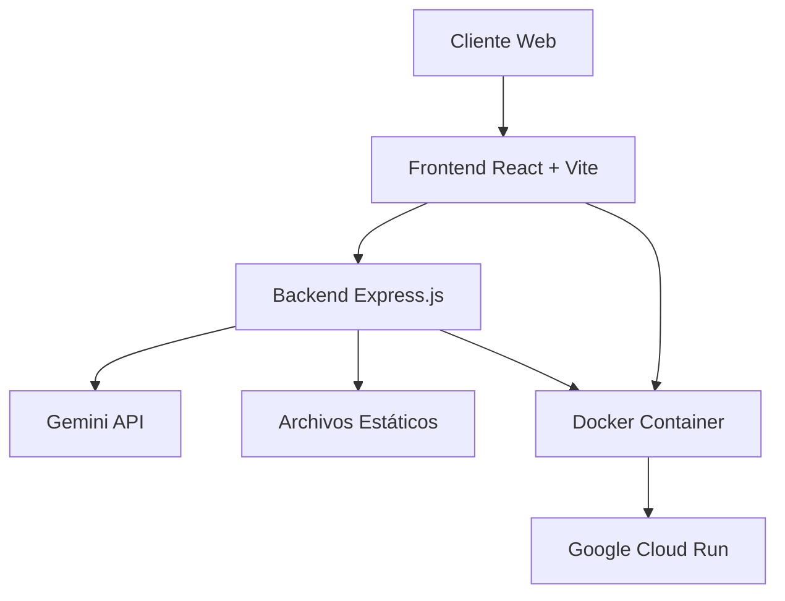

# Manual Técnico - PicShop AI Studio

## 📋 Índice
1. [Información General](#información-general)
2. [Arquitectura del Sistema](#arquitectura-del-sistema)
3. [Stack Tecnológico](#stack-tecnológico)
4. [Estructura de Carpetas](#estructura-de-carpetas)
5. [Setup y Configuración](#setup-y-configuración)
6. [Diseño Visual y UI](#diseño-visual-y-ui)
7. [Componentes Principales](#componentes-principales)
8. [Servicios y APIs](#servicios-y-apis)
9. [Flujo de Desarrollo](#flujo-de-desarrollo)
10. [Deployment](#deployment)
11. [Estándares de Código](#estándares-de-código)
12. [Troubleshooting](#troubleshooting)

---

## 📝 Información General

**PicShop AI Studio** es una aplicación web que permite editar imágenes de productos para catálogos de e-commerce utilizando inteligencia artificial. Los usuarios pueden subir una imagen de producto, proporcionar una descripción de la escena deseada, y la IA genera nuevas imágenes de estilo de vida o centradas en los beneficios del producto.

### Características Principales:
- ✨ Generación de imágenes con IA usando Gemini 2.5 Flash
- 🎨 Editor visual intuitivo con prompts inteligentes
- 📱 Diseño responsive (móvil y desktop)
- 🎯 Escenas predefinidas para generación rápida
- 💡 Sugerencias de prompts generadas por IA
- 🔄 Refinamiento iterativo de imágenes
- 💾 Descarga de imágenes generadas
- 📲 **PWA Instalable**: Se puede instalar como app nativa
- 🔄 **Funciona Offline**: Cache inteligente para uso sin conexión
- 🚀 **Performance Optimizada**: Service Worker con estrategias de cache

---

## 🏗️ Arquitectura del Sistema

La aplicación sigue una arquitectura **Full-Stack** con separación clara entre frontend y backend:



### Componentes Principales:
- **Frontend**: React 19 + TypeScript + Vite
- **Backend**: Node.js + Express.js
- **IA**: Google Gemini 2.5 Flash API
- **Deployment**: Docker + Google Cloud Run
- **CI/CD**: Google Cloud Build

---

## 🛠️ Stack Tecnológico

### Frontend
| Tecnología | Versión | Propósito |
|------------|---------|-----------|
| React | 19.1.1 | Framework principal |
| TypeScript | ~5.8.2 | Tipado estático |
| Vite | ^6.2.0 | Build tool y dev server |
| Tailwind CSS | CDN | Framework CSS |

### Backend
| Tecnología | Versión | Propósito |
|------------|---------|-----------|
| Node.js | 22-alpine | Runtime de JavaScript |
| Express.js | ^4.21.2 | Framework web |
| @google/genai | ^1.15.0 | SDK de Gemini API |
| CORS | ^2.8.5 | Cross-origin requests |

### DevOps y Deployment
| Tecnología | Propósito |
|------------|-----------|
| Docker | Containerización |
| Google Cloud Build | CI/CD Pipeline |
| Google Cloud Run | Hosting serverless |
| Google Secret Manager | Gestión de secretos |

---

## 📁 Estructura de Carpetas

```
picshop/
├── 📁 components/           # Componentes React reutilizables
│   ├── Icons.tsx           # Iconos SVG del sistema
│   ├── ImagePanel.tsx      # Panel de visualización de imágenes
│   ├── ImagePreviewModal.tsx # Modal para vista previa
│   ├── Logo.tsx            # Componente del logo
│   └── Spinner.tsx         # Indicador de carga
├── 📁 hooks/               # Custom React hooks
│   └── useInterval.ts      # Hook para intervalos
├── 📁 services/            # Servicios de API
│   └── geminiService.ts    # Comunicación con Gemini API
├── 📁 server/              # Backend Express.js
│   └── index.js            # Servidor principal
├── 📁 images/              # Assets de imágenes
│   ├── logo1.png           # Logo principal
│   ├── logotit.png         # Logo con título
│   └── 1.png               # Imagen de ejemplo
├── 📁 dist/                # Build de producción (generado)
├── App.tsx                 # Componente principal
├── index.tsx               # Punto de entrada
├── index.html              # Template HTML
├── types.ts                # Definiciones de tipos
├── constants.ts            # Constantes de la aplicación
├── package.json            # Dependencias y scripts
├── tsconfig.json           # Configuración TypeScript
├── vite.config.ts          # Configuración Vite
├── Dockerfile              # Imagen Docker
├── cloudbuild.yaml         # Pipeline CI/CD
├── manifest.json           # PWA Manifest
├── sw.js                   # Service Worker
├── browserconfig.xml       # Configuración Windows
└── README.md               # Documentación básica
```

### Descripción de Carpetas Principales:

#### `/components/`
Contiene todos los componentes React reutilizables. Cada componente debe:
- Ser funcional y usar TypeScript
- Incluir props tipadas
- Seguir la convención PascalCase
- Exportarse como named export

#### `/services/`
Servicios para comunicación con APIs externas:
- `geminiService.ts`: Maneja toda la comunicación con la API de Gemini
- Funciones para conversión de archivos a base64
- Manejo de errores centralizado

#### `/server/`
Backend Express.js que actúa como proxy para la API de Gemini:
- Endpoints `/api/generate` y `/api/suggestions`
- Manejo de secrets y variables de entorno
- Servir archivos estáticos del build

---

## ⚙️ Setup y Configuración

### Prerrequisitos
- **Node.js**: v18 o superior
- **npm**: v8 o superior
- **Gemini API Key**: Obtenida de Google AI Studio

### Instalación Local

1. **Clonar el repositorio**:
   ```bash
   git clone [URL_DEL_REPOSITORIO]
   cd picshop
   ```

2. **Instalar dependencias**:
   ```bash
   npm install
   ```

3. **Configurar variables de entorno**:
   Crear archivo `.env.local` en la raíz:
   ```env
   GEMINI_API_KEY=tu_api_key_aqui
   ```

4. **Ejecutar en desarrollo**:
   ```bash
   npm run dev
   ```
   La aplicación estará disponible en `http://localhost:5173`

5. **Build para producción**:
   ```bash
   npm run build
   npm start
   ```

### Variables de Entorno

| Variable | Descripción | Requerida |
|----------|-------------|-----------|
| `GEMINI_API_KEY` | API Key de Google Gemini | ✅ Sí |
| `NODE_ENV` | Entorno de ejecución | ❌ No (default: development) |
| `PORT` | Puerto del servidor | ❌ No (default: 8080) |

---

## 🎨 Diseño Visual y UI

### Sistema de Colores (Tema Cyberpunk)

```css
:root {
  --cyber-dark: #0a0a0a;      /* Fondo principal */
  --cyber-bg: #1a1a1a;        /* Fondo de componentes */
  --cyber-border: #333333;     /* Bordes y divisores */
  --neon-pink: #f000b8;       /* Acento principal */
  --neon-cyan: #00f2ea;       /* Acento secundario */
  --cyber-text: #e0e0e0;      /* Texto principal */
  --cyber-text-muted: #888888; /* Texto secundario */
}
```

### Efectos Visuales

#### Efectos de Brillo (Glow)
```css
.shadow-glow-pink: 0 0 15px #f000b8
.shadow-glow-pink-lg: 0 0 25px #f000b8
.shadow-glow-cyan: 0 0 15px #00f2ea
.shadow-glow-cyan-lg: 0 0 25px #00f2ea
```

#### Animaciones
- **fade-in**: Aparición suave (0.3s ease-out)
- **spin**: Rotación continua para spinners
- **pulse**: Efecto de pulsación para elementos de carga

### Componentes de UI

#### Botones
- **Primario**: Fondo neon-pink, texto negro, efecto glow al hover
- **Secundario**: Fondo neon-cyan, texto negro, efecto glow al hover
- **Terciario**: Fondo cyber-border, texto muted, hover suave

#### Paneles
- Fondo cyber-bg con borde cyber-border
- Border-radius consistente (8px)
- Hover con borde cyan y glow sutil

#### Inputs
- Fondo cyber-dark con borde cyber-border
- Focus con borde neon-pink y glow
- Placeholder en color muted

---

## 🧩 Componentes Principales

### App.tsx
**Componente raíz** que maneja todo el estado global de la aplicación:

#### Estados Principales:
- `sourceImage`: Imagen original subida
- `generatedImage`: Imagen generada por IA
- `prompt`: Texto del prompt actual
- `status`: Estado de la generación ('idle' | 'loading' | 'success' | 'error')
- `suggestions`: Sugerencias de prompts
- `isModalOpen`: Control del modal de vista previa

#### Funciones Principales:
- `handleGenerate()`: Genera imagen inicial
- `handleRefine()`: Refina imagen existente
- `fetchSuggestions()`: Obtiene sugerencias de IA
- `handleSceneClick()`: Aplica escena predefinida

### ImagePanel.tsx
**Panel reutilizable** para mostrar imágenes con título:
```typescript
interface ImagePanelProps {
  title: string;
  imageUrl: string | null;
  children?: React.ReactNode;
  className?: string;
  onClick?: () => void;
}
```

### geminiService.ts
**Servicio principal** para comunicación con IA:

#### Funciones:
- `fileToBase64()`: Convierte File a base64
- `generateImage()`: Genera/edita imagen
- `generatePromptSuggestions()`: Obtiene sugerencias

---

## 🔌 Servicios y APIs

### Backend Endpoints

#### POST `/api/generate`
Genera o edita una imagen usando Gemini 2.5 Flash.

**Request Body:**
```typescript
{
  base64Image: string;  // Imagen en base64
  mimeType: string;     // Tipo MIME (image/png, image/jpeg, etc.)
  prompt: string;       // Descripción de la edición deseada
}
```

**Response:**
```typescript
{
  image?: string;       // Nueva imagen en base64
  text?: string;        // Texto de respuesta (opcional)
  error?: string;       // Mensaje de error (si hay)
}
```

#### POST `/api/suggestions`
Genera sugerencias de prompts basadas en una imagen.

**Request Body:**
```typescript
{
  base64Image: string;  // Imagen en base64
  mimeType: string;     // Tipo MIME
}
```

**Response:**
```typescript
{
  suggestions: string[]; // Array de sugerencias
  error?: string;        // Mensaje de error (si hay)
}
```

### Integración con Gemini API

#### Configuración del Modelo:
- **Modelo**: `gemini-2.5-flash-image-preview` para generación
- **Modelo**: `gemini-2.5-flash` para sugerencias
- **Modalidades**: IMAGE + TEXT para generación dual
- **Schema**: JSON estructurado para sugerencias

#### Manejo de Errores:
- Validación de API Key
- Timeout y retry logic
- Mensajes de error localizados en español

---

## 🔄 Flujo de Desarrollo

### Git Workflow
1. **Feature Branch**: Crear rama desde `main`
   ```bash
   git checkout -b feature/nueva-funcionalidad
   ```

2. **Desarrollo**: Hacer cambios y commits descriptivos
   ```bash
   git add .
   git commit -m "feat: añadir nueva funcionalidad X"
   ```

3. **Testing**: Probar localmente antes del push
   ```bash
   npm run dev
   npm run build
   ```

4. **Pull Request**: Crear PR hacia `main`

### Convención de Commits
Seguir [Conventional Commits](https://www.conventionalcommits.org/):

- `feat:` Nueva funcionalidad
- `fix:` Corrección de bug
- `docs:` Cambios en documentación
- `style:` Cambios de formato/estilo
- `refactor:` Refactoring sin cambio funcional
- `test:` Añadir o modificar tests
- `chore:` Tareas de mantenimiento

### Testing Local
Antes de hacer push, siempre verificar:

1. **Compilación sin errores**:
   ```bash
   npm run build
   ```

2. **Funcionalidad básica**:
   - Subir imagen ✅
   - Generar imagen ✅
   - Descargar resultado ✅
   - Responsive design ✅

3. **Variables de entorno**:
   - Verificar que `GEMINI_API_KEY` esté configurada
   - Probar con y sin API key para manejo de errores

---

## 🚀 Deployment

### Docker Build

La aplicación usa **multi-stage build** para optimización:

#### Stage 1: Builder
```dockerfile
FROM node:22-alpine AS builder
WORKDIR /app
COPY package.json package-lock.json* ./
RUN npm ci || npm i --legacy-peer-deps
COPY . .
RUN npm run build
```

#### Stage 2: Runner
```dockerfile
FROM node:22-alpine AS runner
WORKDIR /app
ENV NODE_ENV=production
COPY package.json package-lock.json* ./
RUN npm ci --omit=dev || npm i --omit=dev --legacy-peer-deps
COPY --from=builder /app/dist ./dist
COPY server ./server
EXPOSE 8080
CMD ["npm", "start"]
```

### Google Cloud Run

#### Configuración en cloudbuild.yaml:
```yaml
steps:
  # 1. Build Docker image
  - name: 'gcr.io/cloud-builders/docker'
    args: ['build', '-t', '$_LOCATION-docker.pkg.dev/$PROJECT_ID/picshop/picshop:$_TAG', '.']

  # 2. Push to Artifact Registry
  - name: 'gcr.io/cloud-builders/docker'
    args: ['push', '$_LOCATION-docker.pkg.dev/$PROJECT_ID/picshop/picshop:$_TAG']

  # 3. Deploy to Cloud Run
  - name: 'gcr.io/google.com/cloudsdktool/cloud-sdk'
    entrypoint: bash
    args:
      - -c
      - |
        gcloud run deploy picshop \
          --image=$_LOCATION-docker.pkg.dev/$PROJECT_ID/picshop/picshop:$_TAG \
          --platform=managed \
          --region=$_LOCATION \
          --allow-unauthenticated \
          --set-env-vars=NODE_ENV=production \
          --set-secrets=GEMINI_API_KEY=GEMINI_API_KEY:latest
```

#### Variables de Substitución:
- `_TAG`: Versión del deployment (default: 'v1')
- `_LOCATION`: Región de despliegue (default: 'us-central1')

### Secrets Management
- **GEMINI_API_KEY** se almacena en Google Secret Manager
- Se asignan permisos automáticamente al service account
- Se inyecta como variable de entorno en runtime

---

## 📏 Estándares de Código

### TypeScript
- **Strict mode** habilitado
- Tipado explícito para props y estados
- Interfaces para objetos complejos
- Evitar `any`, usar tipos específicos

#### Ejemplo de Componente:
```typescript
interface ComponentProps {
  title: string;
  isLoading?: boolean;
  onAction: (value: string) => void;
}

export const MyComponent: React.FC<ComponentProps> = ({
  title,
  isLoading = false,
  onAction
}) => {
  // Implementación
};
```

### React
- **Componentes funcionales** únicamente
- **Hooks** para estado y efectos
- **Props destructuring** en parámetros
- **Naming**: PascalCase para componentes, camelCase para funciones

#### Estado y Efectos:
```typescript
const [state, setState] = useState<StateType>(initialState);

useEffect(() => {
  // Effect logic
  return () => {
    // Cleanup
  };
}, [dependencies]);

const handleAction = useCallback(() => {
  // Handler logic
}, [dependencies]);
```

### CSS/Tailwind
- **Utility classes** de Tailwind preferidas
- **Custom CSS** solo cuando sea necesario
- **Responsive design** mobile-first
- **Consistent spacing** usando escala de Tailwind

#### Ejemplo de Clases:
```typescript
className="bg-cyber-bg border border-cyber-border rounded-lg p-6 hover:border-neon-cyan transition-all duration-300"
```

### Formateo de Precios
**IMPORTANTE**: Todos los precios deben seguir el formato estándar:
- Separador de miles: punto (.)
- Símbolo: $ al inicio
- Ejemplos: "$1.000", "$10.000", "$100.000", "$1.000.000"

### Archivos y Carpetas
- **kebab-case** para nombres de archivos
- **PascalCase** para componentes React
- **camelCase** para funciones y variables
- **UPPER_CASE** para constantes

---

## 🔧 Troubleshooting

### Problemas Comunes

#### 1. Error de API Key
**Síntomas**: Error 401 o "API key not valid"
**Solución**:
```bash
# Verificar variable de entorno
echo $GEMINI_API_KEY

# Recrear .env.local
echo "GEMINI_API_KEY=tu_api_key_real" > .env.local

# Reiniciar servidor
npm run dev
```

#### 2. Error de Build
**Síntomas**: Fallos en `npm run build`
**Solución**:
```bash
# Limpiar node_modules
rm -rf node_modules package-lock.json
npm install

# Verificar versiones
node --version  # Debe ser >= 18
npm --version   # Debe ser >= 8

# Build con logs detallados
npm run build --verbose
```

#### 3. Error de Docker Build
**Síntomas**: Fallos en construcción de imagen
**Solución**:
```bash
# Build local para debug
docker build -t picshop-debug .

# Verificar logs
docker logs [container_id]

# Verificar variables de entorno
docker run -it picshop-debug env
```

#### 4. Error de CORS
**Síntomas**: Blocked by CORS policy
**Solución**:
- Verificar configuración de CORS en `server/index.js`
- Asegurar que el backend esté corriendo
- Verificar que las URLs de API sean correctas

#### 5. Imágenes no se cargan
**Síntomas**: Assets no encontrados
**Solución**:
```bash
# Verificar estructura de carpetas
ls -la images/
ls -la dist/

# Verificar importaciones
grep -r "images/" src/
```

### Logs y Debugging

#### Logs del Servidor:
```bash
# Desarrollo
npm run dev

# Producción
npm start

# Docker
docker logs [container_name]
```

#### Debug en Browser:
- **DevTools**: F12 → Console/Network
- **React DevTools**: Extensión recomendada
- **Tailwind DevTools**: Para debugging de CSS

### Performance

#### Optimizaciones Implementadas:
- **Code Splitting**: Vite automático
- **Image Optimization**: Lazy loading
- **Bundle Analysis**: `npm run build` muestra estadísticas
- **Caching**: Service Worker automático

#### Monitoreo:
- **Lighthouse**: Auditorías de performance
- **Web Vitals**: Core metrics
- **Cloud Run Metrics**: CPU, memoria, requests

---

## 📲 PWA (Progressive Web App)

### Instalación de la App

La aplicación es una **PWA completamente funcional** que se puede instalar como app nativa:

#### En Dispositivos Móviles:
1. **Android**: Abrir en Chrome → Menú → "Instalar app"
2. **iOS**: Abrir en Safari → Compartir → "Añadir a pantalla de inicio"

#### En Desktop:
1. **Chrome/Edge**: Icono de instalación en la barra de direcciones
2. **Firefox**: Menú → "Instalar esta aplicación"

### Características PWA Implementadas:

#### ✅ **Manifest.json**
```json
{
  "name": "PicShop AI Studio",
  "short_name": "PicShop",
  "display": "standalone",
  "theme_color": "#f000b8",
  "background_color": "#0a0a0a"
}
```

#### ✅ **Service Worker (sw.js)**
- **Cache First**: Para archivos estáticos
- **Network First**: Para contenido dinámico
- **Offline Fallback**: Funciona sin conexión
- **Auto-update**: Detecta nuevas versiones

#### ✅ **Meta Tags Optimizados**
- Apple Touch Icons
- Theme colors
- Open Graph tags
- Twitter Cards

### Estrategias de Cache:

#### Archivos Estáticos (Cache First):
- HTML, CSS, JS, imágenes
- CDN de Tailwind y React
- Logos y assets

#### Contenido Dinámico (Network First):
- Páginas principales
- Fallback a cache si no hay conexión

#### APIs (Network Only):
- `/api/generate` y `/api/suggestions`
- Nunca se cachean (requieren conexión)

### Testing PWA:

#### Herramientas de Validación:
```bash
# Lighthouse audit
npm install -g lighthouse
lighthouse http://localhost:5173 --view

# PWA testing
npm run build
npm start
# Abrir DevTools → Application → Service Workers
```

#### Checklist PWA:
- ✅ Manifest válido
- ✅ Service Worker registrado
- ✅ HTTPS (en producción)
- ✅ Iconos de diferentes tamaños
- ✅ Responsive design
- ✅ Offline functionality

---

## 📚 Recursos Adicionales

### Documentación Oficial
- [React 19](https://react.dev/)
- [TypeScript](https://www.typescriptlang.org/)
- [Vite](https://vitejs.dev/)
- [Tailwind CSS](https://tailwindcss.com/)
- [Google Gemini API](https://ai.google.dev/)
- [Google Cloud Run](https://cloud.google.com/run/docs)

### Herramientas Recomendadas
- **VSCode**: Editor principal
- **React DevTools**: Debugging
- **Tailwind CSS IntelliSense**: Autocompletado
- **Thunder Client**: Testing de APIs
- **Docker Desktop**: Containerización local

### Enlaces Útiles
- [AI Studio App](https://ai.studio/apps/drive/1c7ERa9So1ilg8CpngSgzBlBjoKIkduk5)
- [Guía de Embed](embed-guide.md): Integración en sitios web
- [Ejemplo de Embed](embed-example.html): Demo interactivo
- [Conventional Commits](https://www.conventionalcommits.org/)
- [Semantic Versioning](https://semver.org/)

---

## 🔗 Integración Web (Embed)

### Funcionalidad Embed Implementada

PicShop está optimizado para integrarse en cualquier sitio web mediante iframe:

#### ✅ **Detección Automática**
- Detecta automáticamente si está ejecutándose en iframe
- Adapta la UI para mejor experiencia embebida
- Comunicación bidireccional con el sitio parent

#### ✅ **Configuración Dinámica**
```javascript
// Configurar PicShop desde tu web
iframe.contentWindow.postMessage({
  type: 'PICSHOP_CONFIG',
  config: {
    hideHeader: false,
    compactMode: true,
    maxHeight: 600,
    allowFullscreen: true
  }
}, '*');
```

#### ✅ **Eventos en Tiempo Real**
```javascript
// Escuchar eventos de PicShop
window.addEventListener('message', (event) => {
  if (event.data.type === 'PICSHOP_GENERATION_SUCCESS') {
    console.log('Imagen generada:', event.data);
    // Tu lógica personalizada aquí
  }
});
```

### Opciones de Integración:

#### **1. Iframe Simple**
```html
<iframe src="https://tu-picshop-url.com" width="100%" height="800" frameborder="0"></iframe>
```

#### **2. Iframe Responsivo**
```html
<div style="position: relative; width: 100%; height: 0; padding-bottom: 75%;">
  <iframe src="https://tu-picshop-url.com" style="position: absolute; top: 0; left: 0; width: 100%; height: 100%;" frameborder="0"></iframe>
</div>
```

#### **3. Con Configuración Personalizada**
Ver [embed-guide.md](embed-guide.md) para ejemplos completos.

### Testing del Embed:

#### **Archivo de Prueba Incluido**
```bash
# Ejecutar PicShop
npm run dev

# Abrir embed-example.html en el navegador
# Probar diferentes configuraciones
# Verificar eventos en tiempo real
```

#### **Configuraciones Disponibles:**
- `hideHeader`: Ocultar header con logo
- `compactMode`: Diseño compacto para espacios reducidos
- `maxHeight`: Altura máxima del contenedor
- `allowFullscreen`: Permitir botón de pantalla completa

---

## 🔗 Integración con Alenia Website

### **Configuración Actual (Diciembre 2024)**

PicShop está integrado como **app externa** en el sistema de apps de Alenia Website con redirección directa:

#### **URLs de Configuración:**
- **URL de Producción**: `https://picshop-1071804760043.us-central1.run.app`
- **Ruta en Alenia**: `/apps/picshop`
- **Método**: Redirección automática con `window.location.href`

#### **Archivos de Configuración en Alenia Website:**
```javascript
// src/pages/Apps.jsx - Configuración de la app
{
  id: 'e-pix-editor',
  nombre: 'E-pix Editor',
  descripcion: 'Editor de imágenes con IA',
  color: 'purple',
  link: 'https://picshop-1071804760043.us-central1.run.app',
  external: true,  // Indica redirección externa
  featured: true
}

// src/components/apps/PicShopEmbed.jsx - Componente de redirección
const PICSHOOP_URL = 'https://picshop-1071804760043.us-central1.run.app';

useEffect(() => {
  window.location.href = PICSHOOP_URL;
}, []);
```

### **Flujo de Integración**

1. **Usuario hace clic en "Probar herramienta"** en la página de Apps
2. **Se redirige a `/apps/picshop`** (ruta interna de Alenia)
3. **PicShopEmbed se carga** y muestra pantalla de carga
4. **Redirección automática** a la URL externa de PicShop
5. **Usuario accede a PicShop** en nueva pestaña/ventana

### **Ventajas del Sistema Actual**

#### ✅ **Mejor UX:**
- No hay problemas de iframe (CORS, loading, etc.)
- PicShop se abre en su entorno nativo
- Performance optimizada (no carga iframe pesado)

#### ✅ **Mantenimiento Simplificado:**
- PicShop es independiente de Alenia Website
- Updates de PicShop no afectan al sitio principal
- Deployment separado y autónomo

#### ✅ **SEO y Analytics:**
- Cada app tiene su propia URL y métricas
- Mejor tracking de uso individual
- URLs limpias y compartibles

### **Configuración para Nuevos Deployments**

#### **1. Actualizar URL en Alenia Website:**
```javascript
// En src/pages/Apps.jsx
link: 'https://nueva-url-picshop.com',

// En src/components/apps/PicShopEmbed.jsx
const PICSHOOP_URL = 'https://nueva-url-picshop.com';
```

#### **2. Verificar Integración:**
- Probar redirección desde `/apps/picshop`
- Verificar que se abra en nueva pestaña
- Confirmar que funcione en móvil y desktop

#### **3. Testing de Producción:**
- Deployar cambios en Alenia Website
- Verificar que la redirección funcione en producción
- Monitorear logs de errores

### **Troubleshooting de Integración**

#### **Problema: Redirección no funciona**
**Solución:**
```javascript
// Verificar que la URL sea correcta
console.log('PICSHOOP_URL:', PICSHOOP_URL);

// Agregar fallback manual
<a href={PICSHOOP_URL} target="_blank" rel="noopener noreferrer">
  Ir a PicShop manualmente
</a>
```

#### **Problema: Error de CORS**
**Solución:**
- Verificar configuración CORS en PicShop backend
- Asegurar que `alenia.online` esté en allowed origins

#### **Problema: PicShop no carga**
**Solución:**
- Verificar que PicShop esté desplegado y funcionando
- Revisar logs de Google Cloud Run
- Confirmar que la API key de Gemini esté configurada

### **Monitoreo y Analytics**

#### **Métricas a Monitorear:**
- Clicks en "Probar herramienta" desde Alenia
- Tasa de éxito de redirección
- Tiempo de carga de PicShop
- Errores de redirección

#### **Herramientas de Monitoreo:**
- Google Analytics (Alenia Website)
- Google Cloud Run logs (PicShop)
- Error tracking en ambos sitios

---

## 👥 Equipo de Desarrollo

Para cualquier duda o consulta técnica:

1. **Revisar este manual** primero
2. **Consultar logs** del sistema
3. **Buscar en issues** del repositorio
4. **Crear issue** con detalles específicos

---

*Última actualización: Diciembre 2024*
*Versión del manual: 1.1*
